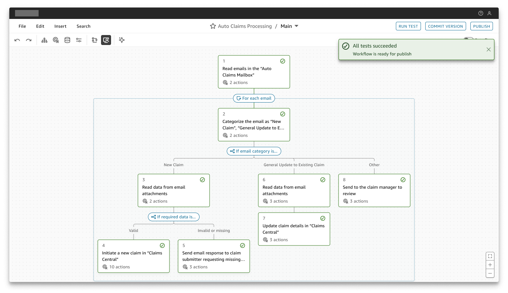

# Employee Assistant

## Use Cases

### Accelerate content creation

Everyone from marketing to sales and engineering can use Amazon Q Business’s generative AI chat interface to boost productivity and creativity. Use it to create email copy, generate blog drafts and summaries, write sales scripts, and more. Empower employees to create content faster across departments.

### Automate complex workflows

The generative AI–powered automation capability in Amazon Q Business can help you create complex workflows quickly (coming soon). Amazon Q Business uses a series of advanced agents to create, edit, and maintain workflows.

### Take actions across applications

Enhance productivity with Amazon Q Business actions, enabling seamless interaction across popular third-party applications, including Jira, ServiceNow, Salesforce, and PagerDuty. Users can perform over 50 actions directly within Amazon Q Business, eliminating the need to switch between systems and saving valuable time.

### Extract key insights

Amazon Q Business unifies access to structured data (databases, warehouses) and unstructured data (documents, wikis, emails), enabling users to gain comprehensive insights and make informed decisions faster, all from a single application.

### Integrate data from Amazon Q Business into your application

Software vendors can integrate into an index created by Amazon Q Business to enhance results from their own generative AI assistants with a single API. End customers remain in control of which applications can access their data, and the index retains fine-grained permissions.

## Amazon Q Business

### What is Amazon Q Business?

Amazon Q Business is the most capable generative AI-powered assistant for finding information, gaining insight, and taking action at work. It makes generative AI securely accessible to everyone in your organization, and helps your employees get work done faster. Anyone in the organization can use natural language to request information or assistance to generate content or create lightweight apps that automate workflows.

### Unified search experience across systems and data

Receive quick, accurate, and relevant answers to complex questions based on your documents, images, files, and other application data, as well as data stored in databases and data warehouses with Amazon Q Business. Users interact with their AI assistant in its web-based conversational interface, inside popular web browsers, and applications like Slack and Microsoft Teams. Results include citations and references for transparency.

### Create and share AI apps to accelerate automation

Amazon Q Apps, a lightweight app creation capability in Amazon Q Business, automates prompting, content creation, workflows, and tasks. For instance, Sales teams can build apps that draft engaging customer e-mails from meeting notes and update customer records. Users can generate apps in a single step by describing requirements in their own words. They can share apps privately with select users, or add them to the organization’s app library for everyone to find, use, duplicate, and customize.

### Perform actions in other applications

Work across applications with ease with a ready-to-use library of over 50 actions across popular business applications and platforms such as Jira, Salesforce, PagerDuty, and more. Users can now perform tasks such as creating and updating tickets, managing incidents, and accessing project information directly from within Amazon Q Business.

### Change the way your organization manages workflows

Automate complex workflows quickly with the generative AI–powered automation capability in Amazon Q Business (coming soon). Upload a standard operating procedure or other documentation, or even create a recording of your workflow. Amazon Q Business analyzes and suggests an automation, and automatically maintains the workflow once in production.

