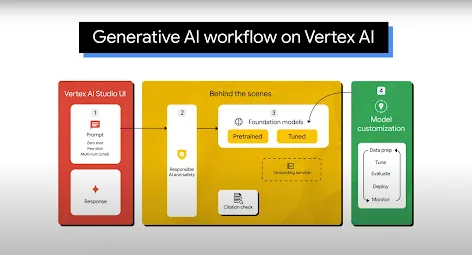

# Knowledge Base from Disparate Datasets

Knowledge bases are a powerful tool for improving the accuracy and relevance of search results. By leveraging the power of generative AI, you can create a knowledge base from disparate datasets, such as unstructured text, images, and videos, to enhance the search experience for your users.

## Use Cases

### Improve search results

By using generative AI to create a knowledge base from disparate datasets, you can improve the accuracy and relevance of search results. This can be especially useful for businesses that rely on search to find relevant information, such as e-commerce websites, news websites, and social media platforms.

### Personalize search results

Generative AI can also be used to personalize search results by analyzing user behavior and preferences. By understanding the context and intent behind a user's search query, you can tailor the results to better meet their needs. This can be particularly useful for businesses that want to provide a personalized experience to their customers.

## Vertex AI

### What is Vertex AI?

Vertex AI is a fully-managed, unified AI development platform for building and using generative AI. Access and utilize Vertex AI Studio, Agent Builder, and 160+ foundation models.

### Gemini, Google’s most capable multimodal models

Vertex AI offers access to Gemini models from Google. Gemini is capable of understanding virtually any input, combining different types of information, and generating almost any output. Prompt and test in Vertex AI with Gemini, using text, images, video, or code. Using Gemini’s advanced reasoning and state-of-the-art generation capabilities, developers can try sample prompts for extracting text from images, converting image text to JSON, and even generate answers about uploaded images to build next-gen AI applications.

In addition to Gemini, you also have access to Gemma, a family of lightweight, state-of-the-art open models built from the same research and technology used to create the Gemini models.

### 150+ generative AI models and tools

Choose from the widest variety of models with first-party (Gemini, Imagen, Codey), third-party (Anthropic's Claude Model Family), and open models (Gemma, Llama 3.1) in Model Garden. Use extensions to enable models to retrieve real-time information and trigger actions. Customize models to your use case with a variety of tuning options for Google's text, image, or code models.

Generative AI models and fully managed tools make it easy to prototype, customize, and integrate and deploy them into applications.

### Open and integrated AI platform

Data scientists can move faster with Vertex AI Platform's tools for training, tuning, and deploying ML models.

Vertex AI notebooks, including your choice of Colab Enterprise or Workbench, are natively integrated with BigQuery providing a single surface across all data and AI workloads.

Vertex AI Training and Prediction help you reduce training time and deploy models to production easily with your choice of open source frameworks and optimized AI infrastructure.

### MLOps for predictive and generative AI

Vertex AI Platform provides purpose-built MLOps tools for data scientists and ML engineers to automate, standardize, and manage ML projects.

Modular tools help you collaborate across teams and improve models throughout the entire development lifecycle—identify the best model for a use case with Vertex AI Evaluation, orchestrate workflows with Vertex AI Pipelines, manage any model with Model Registry, serve, share, and reuse ML features with Feature Store, and monitor models for input skew and drift.

### Agent Builder

Vertex AI Agent Builder enables developers to easily build and deploy enterprise ready generative AI experiences. It provides the convenience of a no code agent builder console alongside powerful grounding, orchestration, and customization capabilities. With Vertex AI Agent Builder developers can quickly create a range of generative AI agents and applications grounded in their organization’s data.

