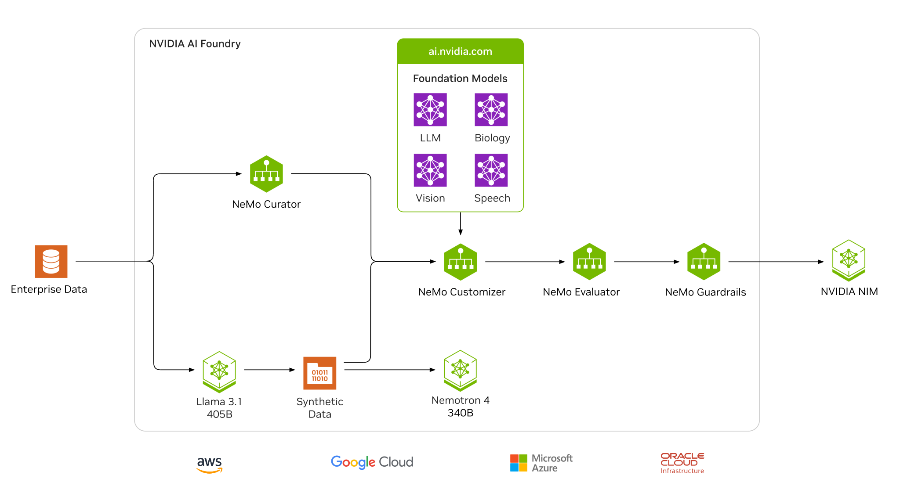

# NVIDIA AI Foundry

NVIDIA AI Foundry is a platform and service for building custom generative AI models with enterprise data and domain-specific knowledge. Just as TSMC manufactures chips designed by other companies, NVIDIA AI Foundry enables organizations to develop their own AI models.

## How it works

The NVIDIA AI Foundry uses enterprise data, along with synthetically generated data, to augment and alter the general knowledge contained in a pretrained foundation model. Once the model is customized, evaluated, and has guardrails, it’s output as an NVIDIA NIM inference microservice. Developers use the NIM’s standard API to build generative AI-powered applications. Knowledge gained from applications in deployment can be fed back into the foundry to further improve custom models.

## Benefits

### Models Built to Your Needs

Start with state-of-the-art foundation models and then create custom models built specifically for your applications’ needs, using your enterprise data and domain expertise.

### Faster Time to Solution

Focus on harnessing the knowledge of your organization and leveraging the game-changing insights of AI, instead of maintaining and tuning your AI development platform.

### Production Ready

Protect data privacy and intellectual property by creating your own models. Run confidently in production environments with NVIDIA Enterprise Support, API stability, and reliable security updates.

### Unprecedented Performance

Build models efficiently using the latest NVIDIA architecture on DGX Cloud with your preferred cloud service providers (CSPs). Deploy custom models with optimized engines, packaged as an easy-to-use NVIDIA NIM inference microservice.

## Use Cases

### AI Chatbots

Organizations are looking to build smarter AI chatbots using custom LLMs and retrieval-augmented generation (RAG). With RAG, chatbots can accurately answer domain-specific questions by retrieving current information from an organization’s knowledge base and providing real-time responses in natural language. These chatbots can be used to enhance customer support, personalize AI avatars, manage enterprise knowledge, streamline employee onboarding, provide intelligent IT support, create content, and more.

### Intelligent Document Processing (IDP)

In financial services, processing documents involves complex data, such as loan records, external regulatory filings, transaction records, public market filings, and more. Financial institutions can use custom generative AI for IDP, such as building chatbots with RAG to automate loan processes or developing market insights for portfolio construction and trade execution.

## Tools

### [LaunchPad](https://www.nvidia.com/en-us/launchpad/)

NVIDIA LaunchPad provides free access to enterprise NVIDIA hardware and software through an internet browser. Users can experience the power of AI with end-to-end solutions through guided hands-on labs or as a development sandbox. Test, prototype, and deploy your own applications and models against the latest and greatest that NVIDIA has to offer.
