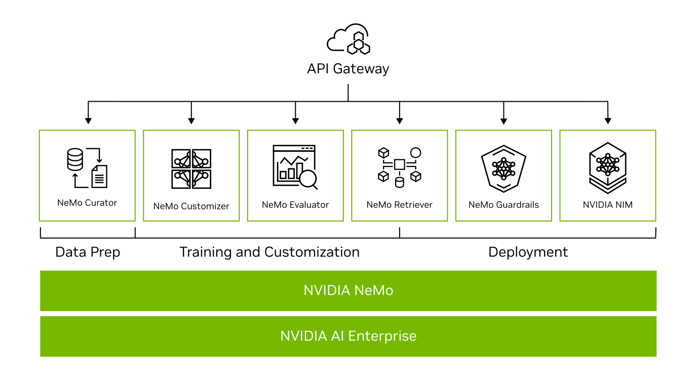
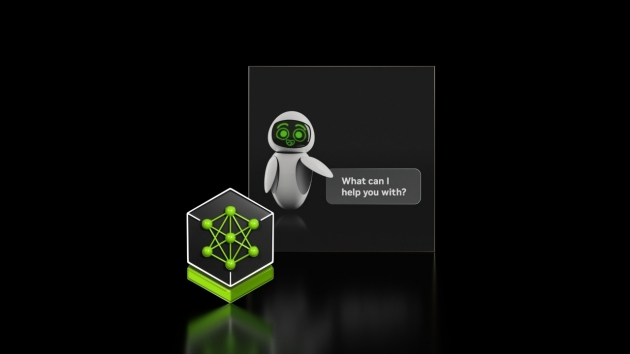
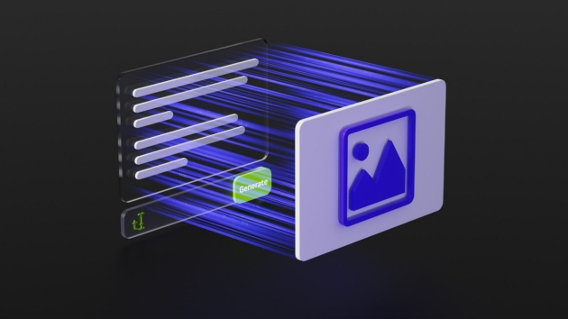

# NVIDIA NeMo

NVIDIA NeMo™ is an end-to-end platform for developing custom generative AI—including large language models (LLMs), vision language models (VLMs), video models, and speech AI—anywhere.

## Benefits

Explore the Benefits of NVIDIA NeMo for Generative AI

### Flexible

Train and deploy generative AI anywhere, across clouds, data centers, and the edge.

### Production Ready

Deploy into production with a secure, optimized, full-stack solution that offers support, security, and API stability as part of NVIDIA AI Enterprise.

### Increased ROI

Quickly train, customize, and deploy large language models (LLMs), VLMs, video, and speech AI at scale, reducing time to solution and increasing ROI.

### Accelerated Performance

Maximize throughput and minimize training time with multi-node, multi-GPU training and inference.

### End-to-End Pipeline

Experience the benefits of a complete generative AI pipeline—from data processing and training to inference and guardrails of AI models.

### Superior Visual Generation

State-of-the-art reconstruction quality using Cosmos tokenizer across a wide spectrum of image and video categories.

## Use Cases

### AI Chatbots

Organizations are looking to build smarter AI chatbots using custom LLMs and retrieval-augmented generation (RAG). With RAG, chatbots can accurately answer domain-specific questions by retrieving current information from an organization’s knowledge base and providing real-time responses in natural language. These chatbots can be used to enhance customer support, personalize AI avatars, manage enterprise knowledge, streamline employee onboarding, provide intelligent IT support, create content, and more.

[Learn More About AI Chatbots](https://www.nvidia.com/en-us/use-cases/ai-for-customer-support/?ncid=pa-srch-goog-701982-brand)

### AI Virtual Assistant

Businesses are deploying AI virtual assistants to efficiently address the queries of millions of customers and employees around the clock. Powered by customized NVIDIA NIM microservices for LLMs, RAG, and speech and translation AI, these AI teammates deliver immediate and accurate spoken responses, even in the presence of background noise, poor sound quality, and diverse dialects and accents.

[Learn More About AI Virtual Assistants](https://www.nvidia.com/en-us/use-cases/ai-for-customer-support/?ncid=pa-srch-goog-701982-brand)

[Try Now](https://build.nvidia.com/nvidia/ai-virtual-assistant-for-customer-service?ncid=pa-srch-goog-701982-brand)

### Multimodal PDF Data Extraction

Trillions of PDF files are generated every year, each file likely consisting of multiple pages filled with various content types, including text, images, charts, and tables. This goldmine of data can only be used as quickly as humans can read and understand it. But with generative AI and RAG, this untapped data can be used to uncover business insights that can help employees work more efficiently and result in lower costs.

[Learn More About Multimodal PDF Data Extraction](https://developer.nvidia.com/blog/build-an-enterprise-scale-multimodal-document-retrieval-pipeline-with-nvidia-nim-agent-blueprint/?ncid=pa-srch-goog-701982-brand)

[Try Now](https://build.nvidia.com/nvidia/multimodal-pdf-data-extraction-for-enterprise-rag?ncid=pa-srch-goog-701982-brand)

### Content Generation

Generative AI makes it possible to generate highly relevant, bespoke, and accurate content grounded in the domain expertise and proprietary IP of your enterprise.

[Learn More About Content Generation](https://www.nvidia.com/en-us/use-cases/content-creation-using-generative-ai/?ncid=pa-srch-goog-701982-brand)

### AI Robot

Service robots are increasingly found in hospitals, airports, and retail stores worldwide. They aid frontline workers by handling daily repetitive tasks in restaurants and manufacturing facilities, assist customers in locating store items, and support physicians and nurses in patient care.

[Read How to Add Speech to Robots](https://resources.nvidia.com/en-us-speech-ai-content/low-code-building-blocks-for-speech-ai-robotics?lx=h9TPm5&ncid=pa-srch-goog-701982-brand)

## Additional Resources

- [NVIDIA NeMo Docs](https://www.nvidia.com/en-us/ai-data-science/products/nemo/)
